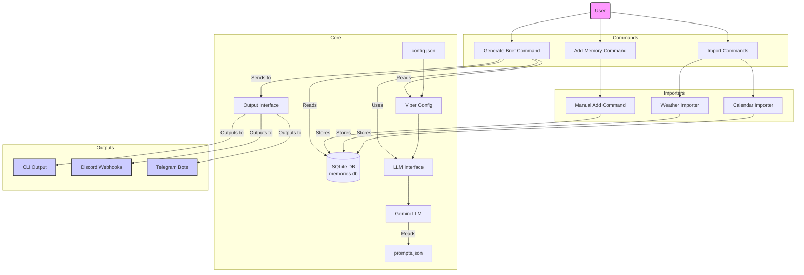

# Hovimestari Project Context

This document provides detailed technical information about the Hovimestari project structure, architecture, and implementation details. It is designed to help LLM agents and developers understand the project quickly.

## Project Overview

Hovimestari ("Butler" in Finnish) is a personal AI butler assistant that generates daily briefs in Finnish. It collects "memories" from various sources (calendar events, weather forecasts, manual notes) and uses Google's Gemini LLM to generate personalized daily summaries.

## Technology Stack

- **Language:** Go (Golang)
- **Database:** SQLite (using `modernc.org/sqlite`)
- **LLM:** Google Gemini (using `github.com/google/generative-ai-go`)
- **Calendar Parsing:** iCalendar (using `github.com/apognu/gocal`)
- **Weather API:** MET Norway Locationforecast API
- **CLI Framework:** Cobra (`github.com/spf13/cobra`)
- **Build System:** Task (`github.com/go-task/task`) with Taskfile.yml

## Directory Structure

```
hovimestari/
├── build/                # Build artifacts directory
├── cmd/
│   └── hovimestari/
│       ├── main.go       # Main application entry point
│       └── commands/     # CLI commands directory
│           ├── add_memory.go
│           ├── generate_brief.go
│           ├── import_calendar.go
│           ├── import_weather.go
│           ├── init_config.go
│           ├── list_models.go
│           └── show_brief_context.go
├── internal/
│   ├── brief/
│   │   └── brief.go      # Handles daily brief generation
│   ├── config/
│   │   ├── config.go     # Legacy configuration (placeholder)
│   │   └── viper.go      # Viper-based configuration management
│   ├── importer/
│   │   ├── calendar/
│   │   │   ├── calendar.go   # Calendar event importing
│   │   │   └── calendar_test.go
│   │   └── weather/
│   │       ├── weather.go    # Weather forecast importing
│   │       └── weather_test.go
│   ├── llm/
│   │   └── gemini.go     # Google Gemini API client
│   ├── output/
│   │   ├── cli.go        # CLI output implementation
│   │   ├── discord.go    # Discord output implementation
│   │   ├── output.go     # Output interface and management
│   │   ├── output_test.go
│   │   └── telegram.go   # Telegram output implementation
│   ├── store/
│   │   └── store.go      # SQLite database operations
│   ├── weather/
│   │   ├── metno.go      # MET Norway API client
│   │   └── metno_test.go
│   └── xdg/
│       └── xdg.go        # XDG Base Directory Specification support
├── docs/
│   ├── project-plan.md   # Project planning documentation
│   └── llm-ollama.md     # Ollama LLM integration documentation
├── config.example.json   # Example configuration file
├── prompts.json          # LLM prompt templates
├── go.mod                # Go module definition
├── go.sum                # Go module checksums
├── Taskfile.yml          # Task runner configuration
└── README.md             # User documentation
```

## Key Files

- **cmd/hovimestari/main.go**: Main application entry point that initializes the Cobra CLI framework and registers all commands.

- **cmd/hovimestari/commands/**: Directory containing individual command implementations:

  - **add_memory.go**: Command for adding memories manually
  - **generate_brief.go**: Command for generating daily briefs
  - **import_calendar.go**: Command for importing calendar events
  - **import_weather.go**: Command for importing weather forecasts
  - **init_config.go**: Command for initializing configuration
  - **list_models.go**: Command for listing available LLM models
  - **show_brief_context.go**: Command for showing brief context

- **internal/brief/brief.go**: Handles the generation of daily briefs by combining memories from the database with context information (date, time, weather, birthdays, etc.) and sending them to the LLM.

- **internal/config/viper.go**: Manages loading and saving application configuration using the Spf13/Viper library. Supports multiple configuration sources (file, environment variables), XDG directory standards, and robust validation. Defines the configuration structure including database path, API keys, location information, calendars, family members, and output settings.

- **internal/config/config.go**: Legacy configuration file, now just a placeholder with all functionality moved to viper.go.

- **internal/importer/calendar/calendar.go**: Fetches and parses calendar events from WebCal URLs and stores them as memories in the database.

- **internal/importer/weather/weather.go**: Imports weather forecasts from the MET Norway API and stores them as memories.

- **internal/llm/gemini.go**: Provides the client for interacting with the Google Gemini API, including methods for generating briefs and responses to user queries.

- **internal/xdg/xdg.go**: Implements support for the XDG Base Directory Specification, providing standardized locations for configuration files and ensuring cross-platform compatibility.

- **internal/output/output.go**: Defines the Outputter interface and implements common output functionality.
- **internal/output/cli.go**: Implements CLI output for sending briefs to the terminal.
- **internal/output/discord.go**: Implements Discord output for sending briefs via webhooks.
- **internal/output/telegram.go**: Implements Telegram output for sending briefs via the bot API.

- **internal/store/store.go**: Manages the SQLite database connection and operations for adding and querying memories.

- **internal/weather/metno.go**: Fetches weather forecasts from the MET Norway Locationforecast API.

- **docs/llm-ollama.md**: Documentation for planned Ollama LLM integration, providing an alternative to Google Gemini for running LLMs locally (not yet implemented).

- **prompts.json**: Contains the prompt templates used for generating briefs and responses to user queries.

- **config.example.json**: An example configuration file showing the required structure and fields, including output configuration options.

- **Taskfile.yml**: Task runner configuration for building, testing, and running the application. Defines tasks for common operations like building for different platforms, running tests, and executing application commands.

## Core Concepts

### Memories

Memories are the fundamental data units in Hovimestari. Each memory represents a piece of information stored in the SQLite database with the following attributes:

- **Content**: The actual information (e.g., "Calendar Event: Meeting with John from 2025-04-20 14:00 to 15:00")
- **CreatedAt**: When the memory was added to the database
- **RelevanceDate**: When the memory is relevant (e.g., the date of a calendar event)
- **Source**: Where the memory came from (e.g., "calendar:work", "weather:helsinki", "manual")
- **UID**: Optional unique identifier (used for calendar events to prevent duplicates)

### Importers

Importers fetch data from external sources and store them as memories in the database:

- **Calendar Importer**: Fetches events from WebCal/iCalendar URLs
- **Weather Importer**: Fetches weather forecasts from the MET Norway API

### Briefs

Briefs are daily summaries generated by the LLM based on relevant memories. They include:

- Today's date and weather
- Ongoing events
- Today's calendar events
- Upcoming days' events and weather
- Special notifications (birthdays, high UV index, etc.)

Briefs are generated in Finnish with a formal, butler-like tone.

### Configuration

The application is configured through a `config.json` file with the following key sections:

- **Database**: Path to the SQLite database file
- **LLM**: Provider (currently only Gemini), API key, model name, and output language
- **Location**: Name, coordinates, and timezone for weather forecasts
- **Calendars**: List of calendars to import events from
- **Family**: List of family members with optional birthdays and Telegram IDs
- **Output**: Configuration for different output methods (CLI, Discord, Telegram)

The configuration system uses Spf13/Viper for robust configuration management, supporting:

- Multiple configuration sources (file, environment variables)
- XDG Base Directory Specification for standard file locations
- Comprehensive validation of configuration values

### LLM Providers

The application currently supports one LLM provider:

- **Google Gemini**: Cloud-based LLM service with API key authentication

Support for additional LLM providers (including Ollama, OpenAI, Anthropic Claude, etc.) is planned for future development as outlined in `docs/project-plan.md`.

## Data Flow



## Database Schema

The SQLite database (`memories.db`) has a single table called `memories` with the following schema:

```sql
CREATE TABLE memories (
    id INTEGER PRIMARY KEY AUTOINCREMENT,
    content TEXT NOT NULL,
    created_at TIMESTAMP NOT NULL DEFAULT CURRENT_TIMESTAMP,
    relevance_date TIMESTAMP,
    source TEXT NOT NULL,
    uid TEXT
);
```

Indexes are created on `relevance_date`, `source`, and the combination of `source` and `uid` to optimize queries.

## LLM Interaction

The application interacts with Google's Gemini LLM through the `internal/llm/gemini.go` module:

1. Prompt templates are stored in `prompts.json` with placeholders for dynamic content
2. The `BuildBriefPrompt` method combines memories, user context, and the prompt template
3. The `Generate` method sends the prompt to the Gemini API and receives the response
4. The response is returned to the user in the specified output format(s)

Prompts include placeholders like `%LANG%` for output language, `%NOTES%` for memories, and `%CONTEXT%` for user context information.

## CLI Commands

The application provides several CLI commands through the Cobra framework:

- **import-calendar**: Import events from configured WebCal URLs
- **import-weather**: Import weather forecasts for the configured location
- **generate-brief**: Generate a daily brief based on stored memories
  - `--days-ahead`: Number of days ahead to include in the brief (overrides config value)
- **add-memory**: Add a memory manually
- **init-config**: Initialize the configuration file
  - `--output-format`: Output format (cli, telegram)
- **list-models**: List available Gemini LLM models
- **show-brief-context**: Show the context that would be sent to the LLM

All commands support a global `--config` flag to specify a custom configuration file path.

## Configuration File Example

### Standard Configuration (Gemini)

```json
{
  "db_path": "memories.db",
  "gemini_api_key": "YOUR_GEMINI_API_KEY",
  "gemini_model": "gemini-2.0-flash",
  "outputLanguage": "Finnish",
  "promptFilePath": "prompts.json",
  "days_ahead": 2,
  "location_name": "Helsinki",
  "latitude": 60.1699,
  "longitude": 24.9384,
  "timezone": "Europe/Helsinki",
  "calendars": [
    {
      "name": "Family Calendar",
      "url": "webcal://p12-caldav.icloud.com/published/2/MTIzNDU2Nzg5MDEyMzQ1Njc4OTAxMjM0NTY3ODkwMTI"
    },
    {
      "name": "Work Calendar",
      "url": "webcal://example.com/work-calendar.ics"
    }
  ],
  "family": [
    {
      "name": "Matti",
      "birthday": "1980-05-15",
      "telegram_id": "matti_v"
    },
    {
      "name": "Maija",
      "birthday": "1982-11-22"
    },
    {
      "name": "Pekka",
      "birthday": "2010-01-30"
    }
  ],
  "output_format": "cli",
  "outputs": {
    "enable_cli": true,
    "discord_webhook_urls": [
      "https://discord.com/api/webhooks/your-webhook-id/your-webhook-token"
    ],
    "telegram_bots": [
      {
        "bot_token": "YOUR_TELEGRAM_BOT_TOKEN",
        "chat_id": "YOUR_TELEGRAM_CHAT_ID"
      }
    ]
  }
}
```

### Planned Ollama Configuration (Not Yet Implemented)

```json
{
  "db_path": "memories.db",
  "llm_provider": "ollama",
  "ollama_url": "http://localhost:11434",
  "ollama_model": "llama3",
  "outputLanguage": "Finnish",
  "promptFilePath": "prompts.json",
  "days_ahead": 2,
  "location_name": "Helsinki",
  "latitude": 60.1699,
  "longitude": 24.9384,
  "timezone": "Europe/Helsinki",
  "calendars": [
    {
      "name": "Family Calendar",
      "url": "webcal://example.com/family-calendar.ics"
    }
  ],
  "family": [
    {
      "name": "Matti",
      "birthday": "1980-05-15"
    }
  ],
  "outputs": {
    "enable_cli": true
  }
}
```

Note: This configuration is for future reference once Ollama support is implemented as outlined in `docs/project-plan.md`.

## Prompt Structure

Prompts are defined in `prompts.json` and include detailed instructions for the LLM:

- **dailyBrief**: Template for generating daily briefs
- **userQuery**: Template for responding to user queries

Each prompt includes placeholders for dynamic content and specific instructions on tone, structure, and content:

- **%CONTEXT%**: Placeholder for context information (date, time, weather, etc.)
- **%NOTES%**: Placeholder for memories/notes
- **%LANG%**: Placeholder for output language
- **%QUERY%**: Placeholder for user queries (in userQuery prompt)
