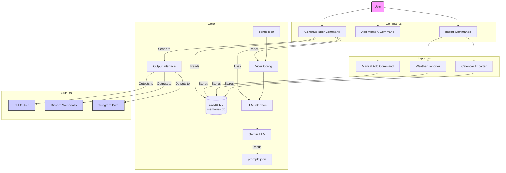

# Architecture

## Directory Structure

```
hovimestari/
├── build/                # Build artifacts directory
├── cmd/
│   └── hovimestari/
│       ├── main.go       # Main application entry point
│       └── commands/     # CLI commands directory
│           ├── add_memory.go
│           ├── generate_brief.go
│           ├── import_calendar.go
│           ├── import_weather.go
│           ├── init_config.go
│           ├── list_models.go
│           └── show_brief_context.go
├── internal/
│   ├── brief/
│   │   └── brief.go      # Handles daily brief generation
│   ├── config/
│   │   ├── config.go     # Legacy configuration (placeholder)
│   │   └── viper.go      # Viper-based configuration management
│   ├── importer/
│   │   ├── calendar/
│   │   │   ├── calendar.go   # Calendar event importing
│   │   │   └── calendar_test.go
│   │   └── weather/
│   │       ├── weather.go    # Weather forecast importing
│   │       └── weather_test.go
│   ├── llm/
│   │   └── gemini.go     # Google Gemini API client
│   ├── output/
│   │   ├── cli.go        # CLI output implementation
│   │   ├── discord.go    # Discord output implementation
│   │   ├── output.go     # Output interface and management
│   │   ├── output_test.go
│   │   └── telegram.go   # Telegram output implementation
│   ├── store/
│   │   └── store.go      # SQLite database operations
│   ├── weather/
│   │   ├── metno.go      # MET Norway API client
│   │   └── metno_test.go
│   └── xdg/
│       └── xdg.go        # XDG Base Directory Specification support
├── docs/
│   ├── project-plan.md   # Project planning documentation
│   └── llm-ollama.md     # Ollama LLM integration documentation
├── config.example.json   # Example configuration file
├── prompts.json          # LLM prompt templates
├── go.mod                # Go module definition
├── go.sum                # Go module checksums
├── Taskfile.yml          # Task runner configuration
└── README.md             # User documentation
```

## Key Files

- **cmd/hovimestari/main.go**: Main application entry point that initializes the Cobra CLI framework and registers all commands.

- **cmd/hovimestari/commands/**: Directory containing individual command implementations:

  - **add_memory.go**: Command for adding memories manually
  - **generate_brief.go**: Command for generating daily briefs
  - **import_calendar.go**: Command for importing calendar events
  - **import_weather.go**: Command for importing weather forecasts
  - **init_config.go**: Command for initializing configuration
  - **list_models.go**: Command for listing available LLM models
  - **show_brief_context.go**: Command for showing brief context

- **internal/brief/brief.go**: Handles the generation of daily briefs by combining memories from the database with context information (date, time, weather, birthdays, etc.) and sending them to the LLM.

- **internal/config/viper.go**: Manages loading and saving application configuration using the Spf13/Viper library. Supports multiple configuration sources (file, environment variables), XDG directory standards, and robust validation. Defines the configuration structure including database path, API keys, location information, calendars, family members, and output settings.

- **internal/config/config.go**: Legacy configuration file, now just a placeholder with all functionality moved to viper.go.

- **internal/importer/calendar/calendar.go**: Fetches and parses calendar events from WebCal URLs and stores them as memories in the database.

- **internal/importer/weather/weather.go**: Imports weather forecasts from the MET Norway API and stores them as memories.

- **internal/llm/gemini.go**: Provides the client for interacting with the Google Gemini API, including methods for generating briefs and responses to user queries.

- **internal/xdg/xdg.go**: Implements support for the XDG Base Directory Specification, providing standardized locations for configuration files and ensuring cross-platform compatibility.

- **internal/output/output.go**: Defines the Outputter interface and implements common output functionality.
- **internal/output/cli.go**: Implements CLI output for sending briefs to the terminal.
- **internal/output/discord.go**: Implements Discord output for sending briefs via webhooks.
- **internal/output/telegram.go**: Implements Telegram output for sending briefs via the bot API.

- **internal/store/store.go**: Manages the SQLite database connection and operations for adding and querying memories.

- **internal/weather/metno.go**: Fetches weather forecasts from the MET Norway Locationforecast API.

- **docs/llm-ollama.md**: Documentation for planned Ollama LLM integration, providing an alternative to Google Gemini for running LLMs locally (not yet implemented).

- **prompts.json**: Contains the prompt templates used for generating briefs and responses to user queries.

- **config.example.json**: An example configuration file showing the required structure and fields, including output configuration options.

- **Taskfile.yml**: Task runner configuration for building, testing, and running the application. Defines tasks for common operations like building for different platforms, running tests, and executing application commands.

## Data Flow


