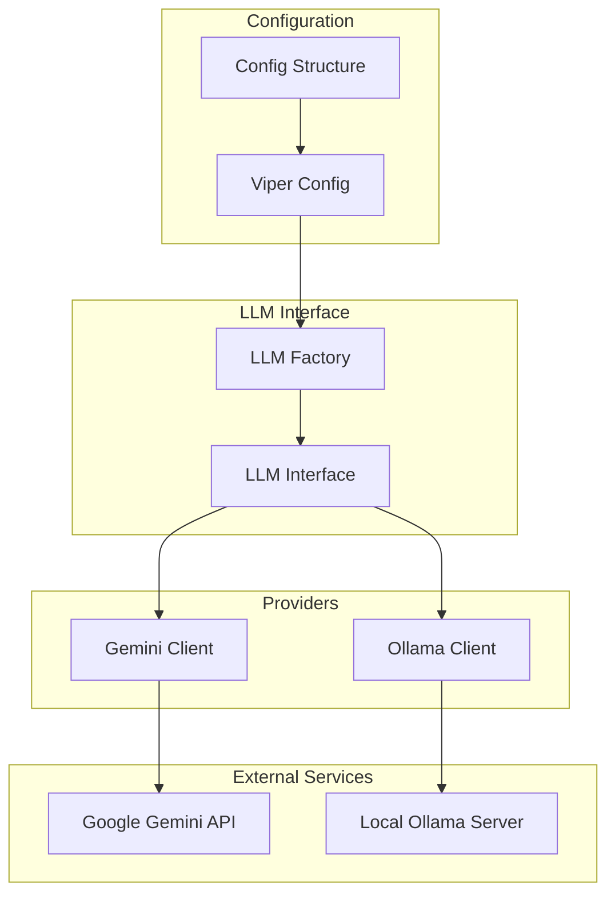

# Ollama Integration for Hovimestari

This document provides comprehensive information about using Ollama as an alternative LLM provider in Hovimestari. Ollama allows you to run large language models locally on your machine, providing privacy, cost savings, and offline capabilities.

## What is Ollama?

[Ollama](https://ollama.ai/) is an open-source tool that simplifies running large language models (LLMs) locally on your computer. It provides:

- Easy installation and setup
- Simple API for interacting with models
- Support for various open-source models (Llama, Mistral, etc.)
- Efficient resource usage with adjustable parameters

Using Ollama with Hovimestari allows you to generate daily briefs without relying on external API services, providing:

- **Privacy**: Your data never leaves your machine
- **Cost savings**: No API usage fees
- **Offline capability**: Generate briefs without internet access
- **Customization**: Fine-tune models and parameters to your needs

## Installation and Setup

### Installing Ollama

Follow these instructions to install Ollama on your system:

#### macOS

```bash
brew install ollama
```

#### Linux

```bash
curl -fsSL https://ollama.ai/install.sh | sh
```

#### Windows

Download the installer from [Ollama's website](https://ollama.ai/download).

### Starting the Ollama Server

To start the Ollama server:

```bash
ollama serve
```

This will start the Ollama API server on `http://localhost:11434` by default.

### Pulling Models

Before using Ollama with Hovimestari, you need to pull the model you want to use:

```bash
# Pull the Llama 3 model (recommended)
ollama pull llama3

# Pull a smaller model for systems with limited resources
ollama pull llama3:8b

# Pull other models
ollama pull mistral
ollama pull gemma:7b
```

You can list available models with:

```bash
ollama list
```

## Configuring Hovimestari to Use Ollama

### Configuration File Changes

To use Ollama with Hovimestari, update your `config.json` file with the following settings:

```json
{
  "llm_provider": "ollama",
  "ollama_url": "http://localhost:11434",
  "ollama_model": "llama3",
  "outputLanguage": "Finnish"
}
```

### Configuration Options

| Option         | Description                                | Default                  |
| -------------- | ------------------------------------------ | ------------------------ |
| `llm_provider` | LLM provider to use ("gemini" or "ollama") | "gemini"                 |
| `ollama_url`   | URL of the Ollama API server               | "http://localhost:11434" |
| `ollama_model` | Model name to use with Ollama              | "llama3"                 |

### Environment Variables

You can also configure Ollama using environment variables:

```bash
export HOVIMESTARI_LLM_PROVIDER=ollama
export HOVIMESTARI_OLLAMA_URL=http://localhost:11434
export HOVIMESTARI_OLLAMA_MODEL=llama3
```

## Usage Guide

### Switching Between Providers

You can easily switch between Gemini and Ollama by changing the `llm_provider` setting in your configuration file or by setting the `HOVIMESTARI_LLM_PROVIDER` environment variable.

### Listing Available Models

To list available Ollama models:

```bash
hovimestari list-models
```

This will show both locally available models and models that can be pulled from Ollama's library.

### Performance Considerations

Local LLM performance depends on your hardware:

- **CPU-only systems**: Expect slower generation times compared to cloud APIs
- **Systems with GPUs**: Can achieve performance comparable to cloud APIs
- **Memory requirements**: Most models require at least 8GB of RAM, with 16GB recommended

### Model Selection Guidelines

| System Specs       | Recommended Model       |
| ------------------ | ----------------------- |
| 8GB RAM, CPU only  | llama3:8b               |
| 16GB RAM, CPU only | llama3                  |
| 16GB+ RAM with GPU | llama3 or larger models |

## Troubleshooting

### Common Issues

1. **"Failed to connect to Ollama server"**

   - Ensure the Ollama server is running with `ollama serve`
   - Check that the `ollama_url` in your configuration is correct

2. **"Model not found"**

   - Pull the model first with `ollama pull <model-name>`
   - Check for typos in the model name

3. **"Out of memory"**

   - Try a smaller model (e.g., llama3:8b instead of llama3)
   - Close other memory-intensive applications

4. **Slow generation times**
   - This is expected on CPU-only systems
   - Consider using a smaller model or upgrading your hardware

## Developer Implementation Details

### Architecture

Hovimestari uses a provider-agnostic interface for LLM interactions, with specific implementations for each provider (Gemini, Ollama). The system uses a factory pattern to create the appropriate client based on configuration.



### Ollama API Endpoints

Hovimestari interacts with the following Ollama API endpoints:

- `POST /api/generate` - Generate text from a prompt
- `GET /api/tags` - List available models

### Request Format

Example request to the Ollama API:

```json
{
  "model": "llama3",
  "prompt": "Generate a daily brief...",
  "stream": false
}
```

### Response Format

Example response from the Ollama API:

```json
{
  "model": "llama3",
  "created_at": "2025-04-23T01:14:29.000000Z",
  "response": "Here is your daily brief...",
  "done": true
}
```

## Limitations and Considerations

### Language Support

While Ollama models support multiple languages, their performance in non-English languages (including Finnish) may not match specialized models like Gemini. You may need to experiment with different models to find the best performance for your language.

### Prompt Formatting

Different models may respond better to different prompt formats. The default prompts in Hovimestari are optimized for Gemini, but may work well with Ollama models too. If you experience issues with the quality of generated briefs, you may need to adjust the prompts in `prompts.json`.

### Resource Usage

Running LLMs locally requires significant system resources:

- **CPU/GPU usage**: Expect high utilization during generation
- **Memory usage**: Models can use several GB of RAM
- **Disk space**: Models can be 4-8GB or larger

### Privacy and Security

While using Ollama keeps your data local, be aware that:

- The models themselves are downloaded from Ollama's servers
- No data is sent back to Ollama during normal operation
- The Ollama API server should not be exposed to the internet without proper security measures

## Future Improvements

Potential future improvements for Ollama integration:

1. **Model parameter customization**: Allow configuring temperature, top_p, and other generation parameters
2. **Model fine-tuning**: Support for fine-tuning models on your personal data
3. **Prompt templates per model**: Optimize prompts for different model architectures
4. **Hybrid mode**: Fallback to cloud APIs when local generation fails or is too slow

## References

- [Ollama Documentation](https://github.com/ollama/ollama/blob/main/README.md)
- [Ollama API Reference](https://github.com/ollama/ollama/blob/main/docs/api.md)
- [Supported Models](https://ollama.ai/library)
